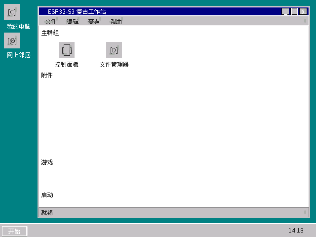
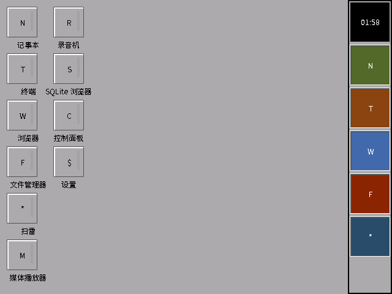
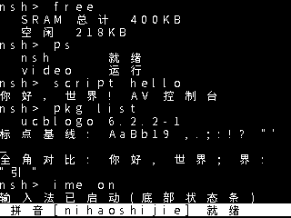
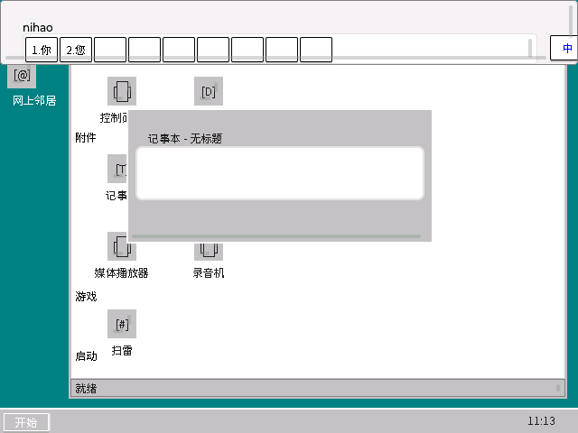

/*
 * SPDX-FileCopyrightText: 2026 Retro WS Project
 * SPDX-License-Identifier: Apache-2.0
 */

> **免责声明 / Disclaimer**
>
> **本系统全部源代码均由 AI 生成**（All system source code is AI-generated）：
> 约 4.3 万行 C 代码（内核驱动、GUI、脚本引擎、包管理器、EDA 载板生成器）
> 由 AI 编写，人类仅负责提出需求、考证硬件事实与验收结果。代码为
> Vibr Coding（边想边写）风格，未经任何实机验证，何时能完成验证仍是
> 未知数。如果您对这个项目感兴趣，欢迎自行 fork 并修改，这可能比等待
> 作者完善更加高效。
>
> **感谢以下 AI 工具的加持（排名不分先后）：**
> - 豆包、Doubao、OpenClaw、OpenCode、Cline、Claude Code、Zcode、MiniMax 2.7、GLM 5.1、GLM 5.3、GLM 5.3 Flash
>
> 没有你们的加持也就没有这个项目，在此一并致谢

---

# 复古工作站 Retro WS / Retro Workstation

基于 Apache NuttX RTOS + LVGL 的纯嵌入式复古图形工作站（原 ESP32-S3 Retro WS，
2026-10 更名 retro-ws）。一套代码支持五种开发板构建目标，横跨 Xtensa / RISC-V /
ARM 三种架构——项目早已不只是"ESP32 项目"。

> **多目标支持（五板）**：开发以 **ESP32-S3** (DevKitC-1, **N16R8/N8R8 首选板**) 为模板，兼容 **ESP32-CAM** (AI-Thinker)、**合宙 ESP32-C3 核心板**（CLI）与 **Raspberry Pi Pico**（CLI，本地教学终端）。
> - **ESP32-S3** (首选/开发模板，构建目标 s3=N16R8 / s3n8=N8R8)：8MB Octal PSRAM + 8/16MB Flash，USB HID 键鼠 + BLE HID，LCD_CAM 并行口 -> 4-bit R-2R 电阻梯 CVBS 输出，显示最高 1024x768（实验）
> - **ESP32-CAM** (兼容目标)：4MB Flash + 4MB PSRAM，内置 DAC (GPIO25/26)，BLE HID 键鼠，板载 OV2640 摄像头（可选，与 CVBS/音频互斥），显示上限 640x480
> - **合宙 ESP32-C3 核心板** (低资源/低价格)：RISC-V 单核 160MHz + 4MB Flash + 400KB SRAM（无 PSRAM），**纯 CLI 工作站**——软件经 .rpk 包管理器安装；经典款（CH343 串口）/ 简约款（原生 USB）均支持；AV 视频走 I2S PDM 单脚输出
> - **Raspberry Pi Pico** (最低成本本地教学终端)：RP2040 双核 Cortex-M0+ @133MHz + 264KB SRAM + 2MB Flash，无网络；**纯 CLI**，AV 视频走 PIO + DMA 逐行输出（Core1 生成）
>
> 显示分辨率三档：**320x240 控制台（240p）/ 640x480 常规（480i）/ 1024x768 最高（实验性）**；
> C3/Pico 为 320x240 字符控制台档（cvbs_console 点阵渲染，AV 输出全系标配）
> 包架构隔离：Xtensa（S3/CAM）/ RISC-V（C3）/ ARM（Pico）二进制互不通用，.rpk 包经 Arch 字段校验

## 项目状态 / Project Status

| 项目 | 内容（更新于 2026-10-05） |
|------|------|
| **当前阶段** | 五板固件**全部编译通过**；宿主测试 + glm 多模态视觉验收闭环；待实机烧录验证 |
| **代码规模** | 手写 C 源码 **~42,400 行** + 自研测试 **~3,700 行** + EDA/工具脚本 **~2,100 行**（另有生成的 12px 全量中文字库点阵 ~15 万行） |
| **多目标支持** | **五板**：ESP32-S3 N16R8 / N8R8 + ESP32-CAM + 合宙 C3（CLI）+ Raspberry Pi Pico（CLI） |
| **编译验证** | **五板全部通过**（2026-10-05：pico 1181KB / c3 1559KB / cam 1912KB / s3·s3n8 1852KB） |
| **宿主验证** | 单元/蜕变/差分/PBT/模糊/双变异门 ALL PASS（12 项套件，语法矩阵 85/85） |
| **EDA 载板** | 五板立创EDA工程已生成（自动布线 + 零交叉校验 PASS） |
| **多语种支持** | **中英双语**（全系唯一 12px 中文字号） |
| **依赖下载** | **完成** |
| **实机测试** | **待开发板**（唯一未开始项） |

### 系统模拟截图 / Simulation Screenshots

以下截图全部由**真实固件源码**无头渲染（非示意图）：GUI 经真实
desktop.c/wmaker_shell.c + LVGL 9.5 以 RGB565 渲染后量化为 **8-bit
256 色调色板**（640x480，Win3.2 时代 VGA 规格）；CLI 经真实
cvbs_console（12px 点阵、12x14 网格）渲染（320x240，240p）。

| Win3.2 外壳（640x480 8bit 彩色） | WindowMaker/NeXT 外壳（640x480 8bit 彩色） |
|:---:|:---:|
|  |  |

| AV 控制台 / CLI（320x240，NSH + 中文 12px 点阵 + CCDOS 式输入法条） |
|:---:|
|  |

**拼音输入法两形态**（2026-10-05）：

| GUI：Win95 式输入条（640x480，拼音+数字选字+中英按钮） | CLI：CCDOS 式底部常驻条（320x240，`ime on` 启动） |
|:---:|:---:|
|  | 见上图控制台截图底部反色条 |

- **GUI**：文本框聚焦自动唤起；键盘 `nihao` → 候选 `1.你 2.您`，数字键选字
- **CLI**：`ime on` 屏幕最下方出现常驻反色输入法条（占末行、正文照常滚动）；
  `Ctrl+Space` 中英切换、`Ctrl+Q` 退出释放；Enter 整行回放给终端

> 截图再生成：`bash tools/sim/build.sh && /tmp/retro_sim/lvgl_sim_color
> && /tmp/retro_sim/console_sim`（宿主机渲染管线，与固件同一份 UI 源码）。

### 已完成里程碑 / Completed Milestones

- [x] M1: 需求分析和方案设计 / Requirements analysis
- [x] M2: 代码编写 / Code development
- [x] M3: 依赖下载和验证 / Dependency download
- [x] M4: 图形界面开发 / GUI development (桌面+应用)
- [x] M5: 拼音输入法开发 / Pinyin IME development
- [x] M6: 多语种框架 / i18n framework
- [x] M7: 工具链安装和编译 / Toolchain & build
- [x] M8: 多目标架构重构 / Multi-target refactoring
- [x] M9: ESP32-CAM 硬件适配 / ESP32-CAM adaptation（编译+宿主验证完成，2026-10-04）
- [x] M10: ESP32-S3 硬件适配 / ESP32-S3 adaptation（编译+宿主验证完成，2026-10-04）
- [x] M14: AV 输出全真硬件化 / True-hardware AV（LCD_CAM/DAC/PDM/PIO + DMA，2026-10-04）
- [x] M15: WS2812 RMT / FSK I2S / 硬件 I2C 收口 + 字号定档 12px（2026-10-05）
- [x] M16: 立创EDA 五板载板工程 / LCEDA carrier boards（2026-10-05）
- [ ] M11: QEMU 模拟验证 / QEMU simulation
- [ ] M12: 开发板烧录 / Board flashing
- [ ] M13: 实机测试 / Hardware testing

### 项目文档 / Project Documentation

| 文档 / Doc | 说明 / Description |
|------|------|
| `README.md` | 项目概览 / Project overview |
| `REQUIREMENTS.md` | 需求说明书 / Requirements |
| `COMPLETED.md` | 已完成需求清单 / Completed requirements |
| `NEXT_STEPS.md` | 下一步工作计划 / Next steps |
| `SYSTEM.md` | 系统架构文档 / System architecture |
| `HARDWARE.md` | 硬件规格参考 / Hardware specification |
| `CODING_STANDARD.md` | 编码规范 / Coding standards |
| `BUILD_FIXES.md` | 构建修复日志 / Build fixes log |
| `DEPENDENCIES.md` | 依赖说明 / Dependencies |

## 快速开始

### 下载依赖

```bash
# 1. 下载所有依赖（源码）——进入克隆出的项目目录
cd retro-ws
./scripts/download_deps.sh

# 2. 下载交叉工具链（axel 多线程；含 Xtensa 与 RISC-V 两套）
./scripts/download_deps.sh --tools-only
./scripts/download_deps.sh --install-tools

# 3. 安装系统依赖 + 第三套 ARM 工具链（Pico 目标用）
sudo apt-get install cmake ninja-build gcc-arm-none-eabi
#    （ARM 也可用自备工具链：解压到 deps/esp-idf-tools/arm/ 即可）

# 4. 激活工具链环境（一次激活全部三套并自检）
source scripts/setup_tools.sh
```

> **三套工具链，按板取用**：
>
> | 工具链 | 服务板 | 位置 / 来源 |
> |--------|--------|-------------|
> | Xtensa (`xtensa-esp-elf-gcc`) | s3 / s3n8 / cam | `deps/esp-idf-tools/xtensa/`（步骤 2 下载） |
> | RISC-V (`riscv32-esp-elf-gcc`) | c3 | `deps/esp-idf-tools/riscv/`（步骤 2 下载） |
> | ARM (`arm-none-eabi-gcc`) | pico | `deps/esp-idf-tools/arm/`（步骤 3 apt 安装或自备） |
>
> 五板统一构建 `scripts/firmware/build_firmware.sh` 自带按板 PATH，可不 source；
> `setup_tools.sh` 主要服务旧三板入口（`scripts/esp32xx/`）与交互式终端。

### 一键整体构建（推荐）

```bash
# 五板固件统一入口（s3/s3n8/cam/c3/pico/all）
./scripts/build_firmware.sh all
# 产物：dist/firmware/<板>/nuttx.bin（Pico 额外生成 nuttx.uf2）

# 固件（Apache-2.0，零 GPL）+ 可选安装包（GPL 组件为独立 ELF）
./scripts/build_all.sh esp32s3          # 或 esp32cam / esp32c3 / all / --no-packages
# 产物：deps/nuttx/nuttx.bin（固件） + dist/sdcard/（SD 安装目录）
# 安装：dist/sdcard 整体拷入 SD 卡，固件侧 pkg list 验证
```

GPL 组件（如 UCBLogo）不编入固件 ROM，以**独立安装包**交付（mere aggregation，
许可证隔离，详见 DEPENDENCIES.md）。

### 脚本直接操作 GPIO（教学模式）

五种脚本语言均可直接读写 GPIO/ADC/PWM（`retro_gpio` 统一接口），
系统占用引脚会被直接拒绝并提示占用原因：

```basic
' BASIC：按键点灯（ESP32-S3，用户按键 GPIO8 -> 扩展脚 GPIO4 接 LED）
CALL retro_gpio_config(8, "in")
CALL retro_gpio_config(4, "out")
DO
  IF retro_gpio_read(8) = 0 THEN CALL retro_gpio_write(4, 1) ELSE CALL retro_gpio_write(4, 0)
LOOP
```
```berry
# Berry：LED 呼吸灯
for i : 0..100
  retro_gpio_pwm(4, i, 1000)
  sleep(10)
end
```
```javascript
// JS：读模拟量
var v = retro_gpio.adc(0);
```
```python
# Python：占用脚会被拦截
import retro_gpio
retro_gpio.config(2, "out")   # -> GPIO2 已被系统占用: CVBS 视频输出
```

### 软件包管理（deb 风格 .rpk）

软件不是裸拷 ELF，而是完整包管理（参考 Debian）：

```bash
# 主机侧打包（包源目录: control/manifest/维护脚本/data 载荷树）
./scripts/make_package.sh <包源目录> <输出目录>

# 设备侧（NSH）
nsh> pkg install /sdcard/pkg/ucblogo-6.2.2-1.rpk   # 安装（依赖检查+CRC 校验）
nsh> pkg list                                        # 已安装列表
nsh> pkg info ucblogo                                # 包详情
nsh> pkg remove ucblogo                              # 卸载（执行 prerm/postrm）
nsh> /sdcard/apps/ucblogo                            # 运行（binfmt 独立进程）
```

### 五板固件编译（统一入口）

```bash
# 用法: build_firmware.sh <s3|s3n8|cam|c3|pico|all>；产物 dist/firmware/<板>/
./scripts/build_firmware.sh s3
./scripts/build_firmware.sh all
```

### 烧录

```bash
# ESP32 系（Xtensa）：esptool（地址表见 AGENTS.md 9.2）
esptool.py --chip esp32s3 --port /dev/ttyUSB0 write_flash ...

# 合宙 C3（RISC-V，从 0x0 引导；经典款 /dev/ttyUSB0，简约款原生 USB 常为 /dev/ttyACM0）
esptool.py --chip esp32c3 --port /dev/ttyUSB0 write_flash 0x0 nuttx.bin

# Pico（UF2）：BOOTSEL 按住上电进 UF2 模式，拖入 nuttx.uf2
#（build_firmware.sh 已用 scripts/make_uf2.py 自动生成）
```

### 旧三板单独编译（scripts/esp32xx/，保留入口）

```bash
# 配置 + 编译 + 烧录（s3 / cam / c3 三板各有独立目录）
cd scripts/esp32s3 && ./nuttx_build.sh defconfig && ./build.sh nuttx && ./build.sh flash
# 同理：scripts/esp32cam/、scripts/esp32c3/（Pico 无旧入口，走统一入口）
```

## 已实现功能 / Implemented Features

| 功能 / Feature | 模块 / Module | 行数 / Lines | 状态 / Status |
|------|------|------|------|
| 双核分工（CPU0=程序核 / CPU1=媒体核） | esp32s3_retro.c / esp32_retro.c / rp2040_retro.c | ~750 | 完成 |
| **WindowMaker/NeXT 外壳（可切换）** | wmaker_shell.c + desktop_api.h | ~430 | 完成（可选） |
| 看门狗 WDT | watchdog.c | ~860 | 完成 |
| 防火墙 Firewall | firewall.c | 623 | 完成 |
| 内存监控 | memmon.c | 537 | 完成 |
| WiFi 连接 | network.c | 432 | 完成 |
| NTP 对时 | ntp.c | 444 | 完成 |
| Cron 定时任务 | cron.c | 739 | 完成 |
| CVBS 显示驱动（四板发射器） | drv_cvbs.c (LCD_CAM) / drv_cvbs_dac.c / drv_cvbs_pdm.c / drv_cvbs_pio.c | ~855+ | 完成 |
| FSK 磁带机 | drv_fsk.c | ~886 | 完成 |
| I2S/DAC 音频 | drv_audio.c / drv_audio_dac.c | ~1234 | 完成 |
| RTC 时钟 | drv_rtc.c | 538 | 完成 |
| USB HID 键鼠 | usb_hid.c (S3，OTG 主机；CAM 无 USB，C3 USB 仅设备模式) | 424 | 完成 |
| 键盘输入（C3/Pico 现状） | cvbs_console.c 内 avkbin 键盘泵（UART/USB-CDC -> /dev/cvbscon）；C3 待补 BLE HID（NEXT_STEPS 36），Pico 无蓝牙/无 USB 主机故串口即唯一路线 | 内嵌 | 完成 |
| BLE HID 驱动 | ble_hid.c (S3/CAM，封存于 IDF 栈选项) | 1001 | 完成 |
| BLE Bond 存储 | ble_storage.c | 391 | 完成 |
| BLE NSH 命令 | ble_nsh.c | 289 | 完成 |
| BLE 配对 UI | ble_pair_ui.c | 252 | 完成 |
| 启动菜单 | bootmenu.c | 502 | 完成 |
| 脚本引擎 | script_engines.c | 649 | 完成 |
| curl/wget | network_utils.c | 487 | 完成 |
| NSH 命令 | nsh_cmds.c | 275 | 完成 |
| LVGL 桌面 | desktop.c | 1136 | 完成 |
| 记事本编辑器 | app_editor.c | 636 | 完成 |
| 浏览器 | app_browser.c | 564 | 完成 |
| 终端模拟器 | app_terminal.c | 673 | 完成 |
| 拼音输入法 | app_pinyin.c | 557 | 完成 |
| 多语种框架 | i18n.c | 493 | 完成 |
| Logo 海龟画图 | logo/ | ~400 | 完成 |
| 扫雷游戏 | desktop.c | 内嵌 | 完成 |
| 文件管理器 | desktop.c | 内嵌 | 完成 |
| 控制面板 | desktop.c | 内嵌 | 完成 |

## 图形界面应用 / GUI Applications

| 应用 / App | 图标 / Icon | 说明 / Description |
|------|------|------|
| 记事本 Notepad | icon_notepad.png | 文本编辑器，支持行号/搜索/多标签 |
| 浏览器 Browser | icon_browser.png | 简易网页浏览器，URL 栏 + HTML 渲染 |
| 终端 Terminal | icon_terminal.png | 命令行终端，16 个内置命令 |
| 扫雷 Minesweeper | icon_minesweeper.png | 经典扫雷游戏 |
| 文件管理器 | icon_folder.png | 磁盘文件浏览 |
| 控制面板 | icon_control_panel.png | 系统设置面板 |
| 我的电脑 | icon_pc.png | 桌面图标 |
| 媒体播放器 | icon_player.png | WAV 音频播放，进度条/音量控制 |
| 录音机 | icon_recorder.png | 音频录制，波形显示 |
| SQLite 工具 | icon_sqlite.png | SQL 查询/执行/结果导出 |
| Logo 海龟画图 | icon_logo.png | 小海龟画图，Logo 语言编程 |

## 硬件规格对比

### 图形档（S3 / CAM，LVGL 桌面）

| 项目 | ESP32-S3 (DevKitC-1 N16R8/N8R8) | ESP32-CAM (AI-Thinker) |
|------|---------------------|----------------------|
| 定位 | **首选板 / 开发模板** | 兼容目标（顺带支持） |
| 主控 | ESP32-S3 (双核 LX7 240MHz, 8MB Octal PSRAM, 8/16MB Flash) | ESP32 (双核 LX6 240MHz, 4MB PSRAM, 4MB Flash) |
| 显示 | CVBS AV 输出（I2S -> 电阻网络 -> GPIO2） | CVBS AV 输出（内置 DAC -> GPIO25） |
| 显示分辨率 | 320x240 / 640x480 / 1024x768（实验） | 320x240 / 640x480（DAC 带宽所限） |
| 音频输出 | 外部 I2S DAC（GPIO40/41/42） | 内置 DAC（GPIO26） |
| 音频输入 | ADC（GPIO1） | ADC（GPIO34） |
| 键盘鼠标 | USB HID + 蓝牙 BLE HID | 蓝牙 BLE HID |
| 状态 LED | WS2812 RGB（GPIO38 v1.1 / GPIO48 v1.0） | 红色 LED GPIO33 + Flash LED GPIO4 |
| SD 卡 | SPI 模式（GPIO10/11/13/14） | SPI 模式（GPIO13/15/2/14） |
| 网络 | WiFi 802.11 b/g/n 2.4GHz | WiFi 802.11 b/g/n 2.4GHz |
| 摄像头 | 无 | 板载 OV2640（可选，与 CVBS/音频互斥） |
| RTC | 软件模拟 I2C（GPIO5/6） | 软件模拟 I2C（GPIO21/22） |
| 按键 | GPIO0/7/8 | GPIO0（GPIO33 为状态 LED） |

### CLI 档（C3 / Pico，无 LVGL 桌面）

| 项目 | 合宙 ESP32-C3 核心板 | Raspberry Pi Pico |
|------|----------------------|-------------------|
| 定位 | 低资源/低价格 CLI 工作站 | 最低成本本地教学终端（无网络） |
| 主控 | ESP32-C3（RISC-V 单核 160MHz，400KB SRAM，4MB Flash，无 PSRAM） | RP2040（双核 Cortex-M0+ @133MHz，264KB SRAM，2MB Flash） |
| CVBS 输出 | I2S0 PDM-TX 单脚 GPIO1 + RC 滤波（真外设 + DMA） | PIO SM0 + DMA 逐行，GP12-15 4-bit R-2R（Core1 生成） |
| 控制台 | /dev/cvbscon 上 AV 屏（320x240）+ UART 键盘泵 | 同左（UART0 / 原生 USB CDC 键盘） |
| 状态 LED | GPIO12/13（高电平点亮） | GP25 板载 LED |
| SD 卡 | SPI（GPIO7 CS/6 MOSI/5 MISO/4 CLK） | SPI0（GP17 CS/19 MOSI/16 MISO/18 SCK） |
| 网络 | WiFi 2.4GHz + BLE 5 | 无（需网络请用 S3/CAM/C3） |
| 教学脚 | GPIO10（首选）等 | GP2-GP11、GP20-22、GP26-28 |

> CLI 档与图形档共享同一套 common 层（脚本引擎、.rpk 包管理器、cvbs_console、
> retro_gpio / retro_bus、nano 编辑器）；RAM 放不下 LVGL 帧缓冲，故无 GUI 桌面。

### 为什么以 ESP32-S3 为开发模板？

**ESP32-S3（首选板）的优势：**
- 8MB Octal PSRAM + 8/16MB Flash，资源充裕
- USB OTG 直接连接 USB 键盘鼠标
- 更新的 LX7 内核架构，GDMA 通用 DMA
- 1024x768 实验性高分辨率输出能力

**ESP32-CAM（兼容目标）的优势：**
- 内置 8-bit DAC（GPIO25/26），可直接输出 CVBS 视频和音频，无需外部芯片
- 板载 OV2640 摄像头，可选拍照功能（与 CVBS/音频互斥）
- 价格低廉，货源充足

> **结论**：驱动一律先按 ESP32-S3 模板编写，再向 CAM / C3 / Pico 适配；
> 板间差异全部收敛在硬件档案（hw_<板名>.h）与各板 CVBS/音频发射器里，
> 其余走 common 共享层。ESP32-CAM 的内置 DAC 使其成为低成本 CVBS 方案的补充选择。

## 软件架构

```
+-------------------------------------------+
|     LVGL 9.x 图形引擎（仅图形档 S3/CAM）     |
|    Windows 3.2 / WindowMaker 复古桌面      |
+-------------------------------------------+
|       NuttShell (NSH) CLI（五板全系）       |
|      my_basic / Duktape / Berry + nano     |
+-------------------------------------------+
|     AV 视频管线（全系标配，CLI/GUI 共用）     |
|  GUI 路径: lv_port_disp -> drv_cvbs        |
|  CLI 路径: cvbs_console 字符控制台          |
|   (/dev/cvbscon, 12px 点阵渲染; 经          |
|    lvgl_font_compat 复用同一字库,           |
|    不依赖 LVGL)                            |
|  共用时序核心 cvbs_core -> 板级发射器:       |
|   S3=LCD_CAM+GDMA / CAM=内置DAC /          |
|   C3=I2S PDM / Pico=PIO+DMA -> 75Ω CVBS    |
+-------------------------------------------+
|          Apache NuttX RTOS (POSIX)         |
|       双核调度 / 文件系统 / 网络协议栈       |
+-------------------------------------------+
|          板级 HAL（NuttX 树内驱动）          |
|    ESP-IDF HAL：S3/CAM/C3；RP2040：Pico    |
+-------------------------------------------+
```

> **CLI 的 AV 输出不经过 LVGL**：NSH 的输出写到字符设备 `/dev/cvbscon`，
> 由 cvbs_console 用 12px 点阵直接渲染进 CVBS 场缓冲（C3/Pico 经
> `CONFIG_NSH_ALTCONDEV` 让 NSH 整个跑在 AV 屏上；S3/CAM 的 AV 控制台
> 用于安全模式/控制台档）。
>
> **为何 GUI 与 CLI 分道而行**：
> - **语义不同**——NSH/nano/输入法是字符流世界（write() + termios），
>   一个 cell 网格（320x240 下 26x17 格）+ 32.6KB 场环即可伺候；
>   LVGL 是像素帧缓冲世界（640x480 8bpp ≈300KB + 128KB LVGL 堆），
>   只有 S3/CAM 的 PSRAM 放得下。
> - **刷新跟得上吗**——跟得上：CVBS 场频由 DMA 永续流锁定（50Hz 240p），
>   与 CPU 解耦，不存在掉帧；cvbs_console 按单元格重画（毫秒级，远快于
>   一场 20ms），整屏字符刷新瞬时完成；静态位图按行光栅化进场环也只需
>   一两场。CLI 档不做 LVGL 窗口 GUI 是 SRAM 预算所限（264~400KB），
>   不是视频带宽问题。
> - **上层分道、下层同轨**——两条路在 cvbs_core 汇成同一场样本流，四种
>   板级发射器（LCD_CAM/DAC/PDM/PIO）对上层无感；字库亦统一（CLI 经
>   lvgl_font_compat 复用同一 12px 点阵，字形逐位一致）。S3/CAM 两条路
>   都编入，按启动模式选择。

## 目录结构

```
retro-ws/
+-- README.md              # 本文件
+-- CODING_STANDARD.md     # 编码规范
+-- SYSTEM.md              # 系统架构文档
+-- HARDWARE.md            # 硬件规格参考
+-- REQUIREMENTS.md        # 需求说明书
+-- COMPLETED.md           # 已完成需求清单
+-- NEXT_STEPS.md          # 下一步工作计划
+-- BUILD_FIXES.md         # 构建修复日志
+-- DEPENDENCIES.md        # 依赖说明
+-- AGENTS.md              # AI Agent 配置文件
+-- scripts/               # 构建脚本
|   +-- download_deps.sh   # 下载所有开源依赖（共享）
|   +-- setup_tools.sh     # 激活工具链环境（共享）
|   +-- verify.sh          # 项目验证（共享）
|   +-- convert_font.sh    # 字体转换（共享）
|   +-- setup_env.sh       # 系统依赖安装（共享）
|   +-- build_all.sh       # 固件 + GPL 安装包一键构建
|   +-- build_packages.sh / make_package.sh   # .rpk 打包
|   +-- sync_src_to_apps.sh / make_uf2.py     # 源同步 / UF2 生成
|   +-- firmware/          # 五板固件统一构建入口
|   |   +-- build_firmware.sh   # <s3|s3n8|cam|c3|pico|all>
|   |   +-- prepare_esp_hal.sh  # NuttX esp-hal 准备
|   +-- esp32s3/           # ESP32-S3 编译脚本（旧入口）
|   |   +-- build.sh
|   |   +-- nuttx_build.sh
|   +-- esp32cam/          # ESP32-CAM 编译脚本（旧入口）
|   |   +-- build.sh
|   |   +-- nuttx_build.sh
|   +-- esp32c3/           # ESP32-C3（合宙核心板）编译脚本（旧入口）
|       +-- build.sh
|       +-- nuttx_build.sh
+-- firmware/              # 五板构建配置与板级脚本
|   +-- s3.appconfig / s3n8.appconfig / cam.appconfig
|   +-- c3.appconfig / pico.appconfig
|   +-- scripts/<板名>/    # 板级演示/教学脚本（打包 ROMFS 入固件）
+-- eda/                   # 五板立创EDA 载板工程（gen_eda.py 自动布线）
+-- tools/                 # 工具和字体资源
|   +-- fonts/            # 字体文件
|   +-- sim/              # LVGL 无头模拟器 + CVBS 全链路管线
+-- configs/               # 配置文件
|   +-- nuttx-defconfig           # NuttX 内核配置
|   +-- nuttx-defconfig-combined  # 组合配置
|   +-- nuttx-defconfig-esp32s3 / -esp32cam / -esp32c3  # 各板 defconfig
|   +-- nuttx-minimal.defconfig   # 最小配置
|   +-- lv_conf.h                # LVGL 配置
+-- examples/              # 示例脚本程序
|   +-- hello.bas         # BASIC 示例
|   +-- hello.js          # JavaScript 示例
|   +-- hello.be          # Berry 示例
|   +-- hello.py          # CPython 示例（仅 S3）
|   +-- spiral.lgo        # Logo 海龟画图示例（jslogo）
+-- deps/                  # 第三方依赖（不纳入版本控制）
+-- src/                   # 源代码
    +-- nuttx/
    |   +-- common/         # 共享代码（启动菜单、脚本引擎、包管理器、
    |   |                   # cvbs_core/cvbs_console、retro_gpio/retro_bus、
    |   |                   # nano 移植层、共享驱动）
    |   +-- esp32s3/        # ESP32-S3 目标（S3/S3N8 共用）
    |   |   +-- driver/     # CVBS LCD_CAM、音频 I2S、USB HID、BLE HID、FSK、WS2812
    |   |   +-- board/      # ESP32-S3-DevKitC-1 板级（hw_esp32s3_devkitc.h）
    |   |   +-- chip/       # ESP32-S3 寄存器定义
    |   |   +-- include/    # 覆盖头文件
    |   +-- esp32/          # ESP32-CAM 目标
    |   |   +-- driver/     # CVBS DAC、音频 DAC、BLE HID、FSK
    |   |   +-- board/      # ESP32-CAM AI-Thinker 板级（hw_esp32cam_aithinker.h）
    |   |   +-- chip/       # ESP32 寄存器定义
    |   |   +-- include/    # 覆盖头文件
    |   +-- esp32c3/        # 合宙 ESP32-C3 目标（CLI）
    |   |   +-- driver/     # CVBS PDM（drv_cvbs_pdm.c）
    |   |   +-- board/      # 合宙核心板板级（hw_esp32c3_luatos.h）
    |   +-- rp2040/         # Raspberry Pi Pico 目标（CLI）
    |       +-- driver/     # CVBS PIO（drv_cvbs_pio.c）
    |       +-- board/      # Pico 板级（hw_rp2040_pico.h）
    +-- lvgl/              # LVGL 驱动和应用
    |   +-- app/           # GUI 应用程序
    |   |   +-- logo/      # Logo 海龟画图
    |   +-- assets/icons/  # 图标资源
    |   +-- audio/         # 音频解码
    |   +-- fonts/         # 字体（全系唯一 12px 中文字库）
    |   +-- modules/       # 脚本模块适配
    +-- arch/xtensa/       # 架构相关代码
```

## 开源组件清单 / Open Source Components

| 组件 / Component | 版本 / Version | 用途 / Purpose | 许可证 / License |
|------|------|------|--------|
| Apache NuttX | 12.12.0 | RTOS 内核（含 RP2040 外设支持，Pico 无需外部 SDK） | Apache 2.0 |
| LVGL | 9.5.0 | 图形引擎 / Graphics library（仅图形档 S3/CAM） | MIT |
| ESP-IDF | v5.5.4 | 乐鑫 HAL（Xtensa 与 RISC-V 即 S3/CAM/C3 共用；Pico 不用） | Apache 2.0 |
| esp-hal-3rdparty | NuttX 配套（mbedtls pin v3.6.2 单体版） | 乐鑫 HAL 装配：WiFi/BLE/PHY/mbedtls 子模块 | Apache 2.0 |
| littlefs | v2.5.1（NuttX 树内） | 文件系统 / Filesystem | BSD-3-Clause |
| SQLite | 3.45.1（nuttx-apps） | 数据库引擎 / Database engine | Public Domain |
| curl | 8.0+（nuttx-apps） | HTTP 客户端 / HTTP client | MIT |
| Duktape | 2.7.0 | JavaScript 引擎 / JS engine | MIT |
| my_basic | 1.0.0 | BASIC 解释器 / BASIC interpreter | MIT |
| Berry（可选） | nuttx-apps 固定 | 类 Python 轻量脚本 / Python-like scripting | MIT |
| CPython（可选，仅 S3） | nuttx-apps 固定 | 完整 Python 3 / Full Python 3 | PSF |
| jslogo（可选） | master | UCBLogo 子集海龟画图 / Turtle graphics | Apache 2.0 |
| Logo Turtle | 自研 | Logo 海龟画图解释器 | MIT |
| **GNU nano** | **8.4** | **CLI 文本编辑器（全系统一，vi 不编入；真源码移植）** | **GPL-3.0** |
| UCBLogo（.rpk 独立包） | 6.2.2 | Logo 解释器（binfmt 独立进程，不入固件 ROM） | GPL-2.0+ |
| NotoSansSC | - | 中文字体（全系唯一 12px 点阵源） | OFL-1.1 |

> **许可证注记**：nano 为 GPL-3.0 且按 AGENTS.md 7.4 编入五板固件（独立 builtin
> 程序，非内核链接）；这与"固件零 GPL"声明（AGENTS.md 11.1 第 9 条）存在张力，
> 边界划分待项目所有者明确定档，见 DEPENDENCIES.md"GPL 独立程序包策略"。
> UCBLogo 等 GPL 解释器一律不编入 ROM，以 .rpk 安装包交付（mere aggregation）。

## 示例程序 / Example Programs

项目自带示例程序，可直接在 NSH 中运行（五种脚本引擎均可配置编译嵌入）：

```bash
# BASIC 程序 (my_basic)
nsh> script run /path/to/hello.bas

# JavaScript 程序 (Duktape)
nsh> script run /path/to/hello.js

# Berry 程序（menuconfig 勾选 RETRO_SCRIPT_BERRY）
nsh> script run /path/to/hello.be

# Python 程序（仅 S3，勾选 RETRO_SCRIPT_PYTHON）
nsh> script run /path/to/hello.py

# Logo 海龟画图（勾选 RETRO_LOGO_JSLOGO，jslogo 库装入 SD 卡）
nsh> script run /path/to/spiral.lgo

# 查看引擎状态 / engine status
nsh> script status
```

示例文件位于 `examples/` 目录：
- `hello.bas` - my_basic 示例：变量、斐波那契、FOR/WHILE 循环、字符串、数组、INPUT 语句
- `hello.js` - JavaScript 示例：斐波那契、阶乘
- `hello.be` - Berry 示例：递归斐波那契、retro_ui 胶水层调用
- `hello.py` - CPython 示例：斐波那契、retro_ui 胶水层调用（仅 ESP32-S3）
- `spiral.lgo` - Logo 示例：TO 过程、REPEAT、递归（螺旋/圆花/五角星）

## 中文字体 / Chinese Font

项目使用 Noto Sans SC 点阵字体（`lv_font_notosans_sc_12.c`，1bpp，UTF-8
全量字符集约 2.1 万字形，Unicode 码点索引）。**全系唯一字号 12px**
（CLI/GUI 共用，见 AGENTS.md 7.3 铁律），不再有第二套字型/字号/字符集转换表。

### 字体转换工具

```bash
# 生成字体文件（需要 Node.js 和 npx）
./scripts/convert_font.sh

# 仅提取字符集（不生成字体）
./scripts/convert_font.sh --charset-only
```

## 脚本 UI 胶水层 / Script UI Glue Layer

脚本可以调用固件里预制的 LVGL UI 组件，无需重新编译固件：

```javascript
// JavaScript 示例
retro_ui.msgbox("标题", "内容");
var result = retro_ui.input("输入", "请输入:", 64);
var choice = retro_ui.list("选择", "选择一个:", ["选项1", "选项2"]);
retro_ui.status("处理中...");
retro_ui.progress(50, 100);
```

```basic
' BASIC 示例
CALL retro_ui_msgbox("标题", "内容")
CALL retro_ui_status("处理中")
```

## 测试

```bash
# 五板全编译（统一入口）
./scripts/build_firmware.sh all

# 单板（旧入口，s3 / cam / c3 三板）
cd scripts/esp32s3 && ./build.sh nuttx

# 宿主测试套件（单元/蜕变/差分/PBT/模糊/双变异门）
bash tests/host/run_all.sh
```

### 串口连接

```bash
# 查看串口
ls /dev/ttyUSB*

# 连接 NSH
minicom -D /dev/ttyUSB0 -b 115200
```

## 参考文档

- [NuttX 官方文档](https://cwiki.apache.org/confluence/display/NUTTX)
- [ESP-IDF 编程指南](https://docs.espressif.com/projects/esp-idf/zh_CN/latest/)
- [LVGL 文档](https://docs.lvgl.io/)

---

_最后更新: 2026-10-05（项目更名 retro-ws，文档全面修正为五板多架构定位）_

## 2026-10-04（晚）全真硬件化升级

- **AV 视频输出真硬件化**：S3=LCD_CAM 并行口+GDMA、CAM=内置 DAC+整帧环、C3=I2S PDM sigma-delta、Pico=PIO+DMA 逐行（Core1 生成）——全部 DMA 流式，CPU 零忙等
- **真 GNU nano 8.4 移植**（deps/nano 上游源码 + mini-curses 垫片）：全系 CLI 文本编辑器统一 nano，vi 移除
- **NSH 跑 AV 电视屏**：/dev/cvbscon 字符终端（ANSI/CSI + 反色 + 光标）+ UART 键盘泵（C3/Pico）
- **retro_bus 总线兼容层**：I2C/SPI/UART（MicroPython machine 风格，硬件后端 + 位摆软回退，三引擎绑定）
- **板级脚本 ROM XIP**：firmware/scripts/<板>/ 打包 ROMFS，\`script hello\` 从 Flash 直跑（零 RAM 拷贝）
- **builtin 接线**：sysinfo/pkg/shell/script/nano 成为真实 NSH 命令（原先命令表是死代码）

五板产物 dist/firmware/：pico 1.40MB/2MB(68%)、c3 1.77MB/4MB(43%)、cam 2.13MB/4MB(52%)、s3/s3n8 2.07MB（16MB/8MB 13%/25%）；dram0 静态占用 16%~44%，全部达标。

## 2026-10-04（深夜）硬件全真外设收口 + EDA 载板

- **WS2812 状态灯真硬件化**：新增 `ws2812_rmt.c`（RMT 外设经 NuttX
  /dev/rmt0，替代点不亮的 gpio 直驱）；s3/s3n8 固件已开 `CONFIG_ESP_RMT`
- **FSK 磁带 TX 接通硬件**：`fsk_send() → audio_play_pcm()`（I2S/DAC DMA），
  drv_fsk.c 首次纳入构建（补 Kconfig `RETRO_FSK_BAUD`）
- **RTC/总线硬件 I2C**：s3/s3n8（I2C0 @GPIO5/6）与 cam（I2C0 @GPIO21/22）
  appconfig 开 `CONFIG_I2C_DRIVER` + 芯片 I2C0 → /dev/i2c0
- **GUI 启动崩溃修复**：`lv_port_disp_init()` 曾在帧缓冲分配前 memset
  空指针（cvbs_pipeline 模拟器捕获）
- **硬件档案修正**（网络核实）：合宙 C3 板载 LED=GPIO12/13 **高电平**
  点亮（原文档误写低电平）、Flash 占用=GPIO11(VDD_SPI)/14-17；Pico CVBS
  移脚 GP12-15（GP23=SMPS 脚会污染 3V3 基准）；CAM 补 GPIO17=PSRAM CLK；
  新增"板上指示灯引脚避让"原则（test_hw_profiles.c 契约测试钉死）
- **eda/ 五板立创EDA载板工程**：全插接件设计（模块+外围+电阻网络全走
  母排/FPC 座），内置两层自动布线器，同层异网零交叉校验 PASS——详见
  `eda/README.md`

五板固件复验：pico 1396KB/c3 1774KB/cam 2130KB/s3/s3n8 2069KB，全部 OK；
宿主测试套件 ALL PASS（含 ws2812 353 项 + 占用表契约 219 项 + 双变异门 ≥80%）。

## 2026-10-05 字号考据定档：GUI=12px / 控制台=16px

上网考证老系统界面字号后定档（详见 HARDWARE.md 6.4 字号表）：

- **GUI（640x480）默认 12px**（`lv_font_notosans_sc_12.c`，新增）——对齐
  中文 Windows 3.2/95 界面**宋体 9pt=12px 内置点阵**的传世标准；拉丁侧
  Win3.x MS Sans Serif 8pt@96DPI≈11px 同级。原 16px 相当于"大字体"模式，
  原默认 14px（LVGL montserrat）不符合中文老系统传统
- **控制台（320x240 240p）保持 16px**——恰为 FC/SFC 中文游戏 16x16
  点阵标准（cvbs_console 网格 CELL 16x18 即按此设计），不改
- 用户直觉的 7-9px 对应 DOS CGA 8x8 / VGA 9x16 的**拉丁等宽终端格子**；
  中文点阵历史下限即 12px，7-9px 中文在老系统上不存在
- 落地：`convert_font.sh` 两档齐生、`RETRO_FONT_DEFAULT` 按档自动选择
  （GUI 构建=12 / CLI=16）、`LV_FONT_DEFAULT`=montserrat_12；
  glm53f 多模态验收 12px 中文点阵清晰可辨（两种外壳截图 pass）

### 2026-10-05（同日修订）：收敛为全系唯一 12px 字号

早间方案（GUI=12 / 控制台=16 两档）当日即被推翻：**嵌入式体积优先，
全系 CLI/GUI 只保留一个字号档——12px**：

- `lv_font_notosans_sc_16.c` 废除删除；`convert_font.sh` 只生 12px 档
- `cvbs_console` 网格 16x18 → **12x14**（320x240→26 列x17 行；
  640x480→53 列x34 行，达到 DOS 80x25 量级信息密度）
- `RETRO_FONT_DEFAULT`/`RETRO_FONT_CONSOLE` 统一指向 12px；CLI 兼容层
  （lvgl_font_compat）同步；LVGL 默认字体 montserrat_12
- glm53f 多模态验收：640/240p 两档控制台 + Win3/wmaker 桌面全 pass
  （240p 的 12px 为可读下限，实机 CRT 抽验登记 NEXT_STEPS）
- 体积收益：字体 .o 从 911KB（16px）降到约 0.6MB（12px），五板 CLI 档
  固件全体缩小
